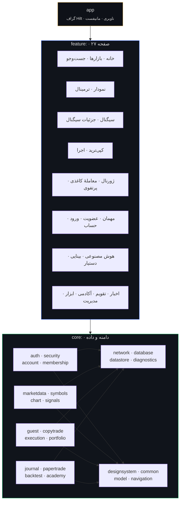
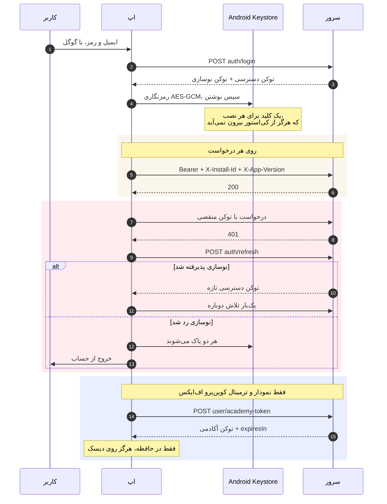
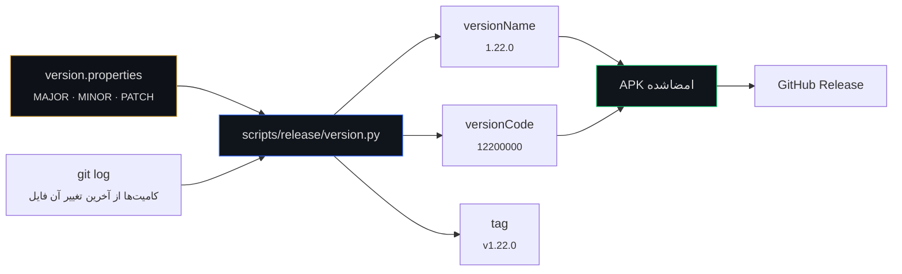

<div align="center">


<br>

[English](README.md) · **فارسی**

<br>

[](CHANGELOG.md)
[](https://kotlinlang.org)
[](https://developer.android.com/jetpack/compose)
[](https://developer.android.com)
[](LICENSE)

</div>

---

## این چیست

کوین‌پرو یک کلاینت نیتیو اندروید برای دو بک‌اند مستقل است — **کوین‌پرو اف‌ایکس** (طلا، نقره و
فارکس، با کپی‌تریدینگ روی متاتریدر) و **تریدیار** (رمزارز، روی LBank). یک اپ، یک حساب برای هر
پلتفرم، و یک کلید در بالای صفحهٔ خانه.

این یک **ترمینال بازار** است، نه کیف پول و نه صرافی. هیچ‌وقت پولی نگه نمی‌دارد، هیچ‌وقت کلید خصوصی
نگه نمی‌دارد، و هیچ‌وقت حضانت چیزی را نمی‌پذیرد. جایی که کاربر حساب صرافی یا بروکر خودش را وصل
می‌کند، سفارش روی همان حساب و با اعتبارنامه‌ای که خودش داده گذاشته می‌شود.

اپ **بدون ثبت‌نام** باز می‌شود. بازار، نمودار، اخبار و کارنامهٔ منتشرشدهٔ سیگنال‌ها همه برای مهمان
در دسترس‌اند؛ سیگنال و کپی‌ترید حساب رایگان می‌خواهند.

<table>
<tr>
<td width="25%" align="center"><b>۵۹</b><br><sub>ماژول Gradle</sub></td>
<td width="25%" align="center"><b>۲۷</b><br><sub>صفحهٔ کاربری</sub></td>
<td width="25%" align="center"><b>۷۸۳</b><br><sub>تست واحد</sub></td>
<td width="25%" align="center"><b>۸۹۸</b><br><sub>آیکون برداری نماد</sub></td>
</tr>
<tr>
<td align="center"><b>~۶۱٫۵ هزار</b><br><sub>خط کاتلین</sub></td>
<td align="center"><b>۲</b><br><sub>بک‌اند</sub></td>
<td align="center"><b>۴</b><br><sub>گیت کیفیت در CI</sub></td>
<td align="center"><b>fa-IR</b><br><sub>زبان پیش‌فرض، راست‌به‌چپ</sub></td>
</tr>
</table>

---

## فهرست

۱. [معماری](#معماری)
۲. [دو بک‌اند](#دو-بکاند)
۳. [نشست‌ها و توکن‌ها](#نشستها-و-توکنها)
۴. [حالت مهمان](#حالت-مهمان)
۵. [نمودار](#نمودار)
۶. [سیستم طراحی](#سیستم-طراحی)
۷. [عدد، تاریخ و جهت](#عدد-تاریخ-و-جهت)
۸. [وضعیت امنیتی](#وضعیت-امنیتی)
۹. [نسخه‌گذاری](#نسخهگذاری)
۱۰. [ساخت و اجرا](#ساخت-و-اجرا)
۱۱. [گیت‌های کیفیت](#گیتهای-کیفیت)
۱۲. [ساختار مخزن](#ساختار-مخزن)
۱۳. [فهرست مستندات](#فهرست-مستندات)
۱۴. [پروانه](#پروانه)

---

## معماری

سه لایه، و قاعدهٔ بینشان یک‌طرفه است: یک `feature` می‌تواند به `core` وابسته باشد، یک ماژول `core`
می‌تواند به `core`های دیگر وابسته باشد، و هیچ چیزی به `app` وابسته نیست. `app` فقط برای سیم‌کشی
وجود دارد — گراف Hilt، میزبان ناوبری و مانیفست را دارد و تقریباً هیچ منطقی ندارد.



**چرا این‌همه ماژول.** دو دلیل، و هیچ‌کدام سلیقه نیست. اول زمان ساخت: تغییر یک صفحه همان صفحه را
دوباره کامپایل می‌کند، نه کل اپ را. دوم اینکه مرز ماژول تنها قاعدهٔ وابستگی است که کامپایلر واقعاً
اجرایش می‌کند — `feature:journal` **نمی‌تواند** دست داخل `feature:chart` ببرد چون Gradle اجازه
نمی‌دهد، و هیچ عجله‌ای هم راضی‌اش نمی‌کند.

**الگوی داخل هر ماژول.** هر دامنه از سه تکهٔ یکسان ساخته شده:

| تکه | مسئولیت | بدون چه چیزی تست می‌شود |
| --- | --- | --- |
| `…Api` | رابط Retrofit و DTOها. فقط شکل سیم. | — |
| `…Gateway` | تبدیل DTO به دامنه، و نگاشت هر خطا به `AppResult`. | سرور |
| `…Controller` | `StateFlow` وضعیت رابط، و تصمیم‌ها. | اندروید |

یک `Controller` هیچ‌وقت DTO نمی‌بیند و یک `Gateway` هیچ‌وقت `StateFlow` نمی‌بیند. همین جدایی است
که باعث می‌شود ۷۸۳ تست روی JVM در چند ثانیه و بدون شبیه‌ساز اجرا شوند.

---

## دو بک‌اند

این‌ها واقعاً دو محصول متفاوت‌اند که اتفاقاً یک اپ مشترک دارند. تفاوت‌ها ظاهری نیستند — پیشوند
مسیرها، پاکت پاسخ، شکل خطا و مجموعهٔ امکانات همه فرق دارند، و وانمود کردن به عکسش همان چیزی است که
باعث می‌شود یک نشست رمزارز از سرور فارکس مسیری را بخواهد که هرگز نداشته است.

| | کوین‌پرو اف‌ایکس | تریدیار |
| --- | --- | --- |
| بازار | طلا، نقره، فارکس | رمزارز، روی LBank |
| پیشوند مسیر | `user/…` | `api/mobile/v1/…` |
| اجرا | **کپی‌تریدینگ** — اتصال متاتریدر، موتور آینه می‌کند | سیگنال؛ کاربر روی صرافی خودش معامله می‌کند |
| پاکت پروفایل | بدون پوشش | داخل کلید `user` |
| پاکت خطا | `{"detail":{"code","message"}}` | استاندارد RFC 7807 |
| عضویت | اشتراک | افیلیت — UID صرافی، احرازشده از خودِ صرافی |
| ترمینال | ترمینال وب کامل، پشت توکن آکادمی | — |

هر دو از یک `NetworkFactory` عبور می‌کنند، ولی با `OkHttpClient` و انبار نشست و شناسهٔ نصبِ جدا
برای هر پلتفرم. **جدا بودن شناسهٔ نصب** عمدی است: یک نصب دو شناسهٔ متفاوت ارائه می‌دهد، پس هیچ‌کدام
از دو بک‌اند نمی‌تواند حضور کاربر روی دیگری را از رویش بخواند.

هر مسیر در یک تست پین شده. این تشریفات نیست — یک پیشوند هاردکدشده یک‌بار باعث شد هر بازیابی نشست
رمزارز به ۴۰۴ بخورد، و اپ آن را به کاربر «نشست هست ولی قابل اعتبارسنجی نبود» گزارش می‌کرد؛ یعنی
پیام قطعی سرویس برای یک اشتباه سیم‌کشی.

---

## نشست‌ها و توکن‌ها

سه اعتبارنامه وجود دارد، و هر کدام عمر متفاوت، دامنهٔ متفاوت و جای نگهداری متفاوتی دارد.



**توکن دسترسی و نوسازی** با AES-GCM و زیر کلیدی که در کی‌استور اندروید ساخته شده رمزنگاری می‌شوند،
و کلید تنظیمات برای هر پلتفرم جداست تا نشست یک بک‌اند به‌جای دیگری خوانده نشود.

**توکن آکادمی** مشتق‌شده، کوتاه‌عمر و فقط در حافظه است. نوشتنش روی دیسک یعنی یک راز دوم برای
محافظت، آن هم برای صرفه‌جویی در یک درخواست در هر دوازده ساعت. عمرش از `expiresIn` نسبی خوانده
می‌شود نه از زمان مطلق، چون گوشی‌ای که ساعتش غلط است زمان مطلق را با یک «الان»ِ غلط مقایسه می‌کند و
جواب غلط می‌گیرد — یک ساعت جلو باشد، هر توکن تازه منقضی به‌نظر می‌رسد.

**توکن مهمان** هیچ حسابی نمی‌سازد، نوسازی نمی‌شود، و سه مسیر نمودار را باز می‌کند. توکن نوسازی برای
کسی که ثبت‌نام نکرده، یک شناسهٔ ماندگار است — دقیقاً همان چیزی که حالت مهمان نباید داشته باشد.

---

## حالت مهمان

اپ قبلاً روی فرم ورود باز می‌شد. آن یک فیلد رمز است که پیش از هر دلیلی برای پر کردنش پرسیده
می‌شود، جلوی کسی که یک لینک را دنبال کرده و هنوز نمی‌داند این چیز ارزش یک حساب را دارد یا نه.

حالا روی بازار باز می‌شود. قیمت‌های واقعی، تیترهای منتشرشده، جامعه، و **کارنامهٔ سیگنال‌ها** — هر
ردیف یک سیگنال واقعیِ منتشرشده که بسته شده، با همان سودی که واقعاً ثبت شده. هیچ چیزی محو یا بریده
نشده تا نکته‌ای ساخته شود؛ چیزی که طوری آراسته شود که دریغ‌شده به‌نظر برسد یک آگهی است، و این خودِ
محصول است.

کارت عضویت زیرش چهار شرط را کامل می‌گوید و **لینک‌های معرف واقعی را از سرور** می‌آورد. همین آخری
باربر است: لینکی که در اپ کامپایل شود روزی که عوض شود غلط می‌شود، و لینک غلط آشکارا شکست نمی‌خورد —
صرافی فقط آن حساب را به‌نام کوین‌پرو ثبت نمی‌کند، و کاربر بعد از شارژ کردن و فرستادن UID با دلیلی
رد می‌شود که هیچ چیزی روی صفحه نمی‌تواند توضیحش بدهد.

---

## نمودار

یک موتور روی `Canvas` کامپوز، پورت‌شده از محصول وبِ قبلی مالک، نه پیچیده‌شده دور یک کتابخانه. کندل،
هایکین‌آشی، خطی و ناحیه‌ای؛ حرکت، بزرگ‌نمایی و کراس‌هیر؛ اندیکاتورها؛ ابزارهای ترسیم؛ و رندرِ ستاپ
که هم سیگنال هوش مصنوعی و هم اسکریپت‌نویسی ترمینال به آن می‌ریزند.

پیرامونش:

* **ریپلی کندل** — اندیکاتورها، سطوح و نشانگرها همه از یک `visibleSeries` مشتق می‌شوند، پس ریپلی
  نمی‌تواند یک کندل از آینده را به میانگین متحرک نشت بدهد.
* **برگهٔ ستاپ** — نسبت ریسک به ریوارد، فاصله‌ها و حجم پوزیشن از روی ریسک، خوانده از تازه‌ترین
  ترسیم کاملِ خرید/فروش.
* **بک‌تست** — سه استراتژی، پر شدن در **قیمتِ باز شدنِ کندلِ بعدی**، هزینهٔ پیش‌فرض ۵ صدم درصد نه
  صفر، و دراودان از قله تا کف. بک‌تستی که در بسته‌شدنِ کندلِ سیگنال پر شود، ماشینِ تولیدِ مزخرفاتِ
  دلگرم‌کننده است.
* **چیدمان‌های ذخیره‌شده** — نوع، تایم‌فریم و اندیکاتورها. عمداً **بدون** ترسیم‌ها: یک خط روند به
  قیمت‌ها و تاریخ‌های یک نماد چسبیده، و چیدمانی که ترسیم حمل کند خطوط هفتهٔ پیش را روی هر نموداری
  که اعمال شود می‌چسباند.
* **اشتراک‌گذاری** — خودِ نمودار، نه صفحه، از راه FileProviderی که به یک پوشهٔ کش محدود است و برای
  یک اینتنت مجوز می‌گیرد.

> **`namascript` به‌صورت نیتیو بازنویسی نشده است.** این یک زبان اسکریپت‌نویسی شبیه Pine است که با
> `new Function()` داخل یک Web Worker ارزیابی می‌شود، و هیچ معادل کاتلینی ندارد مگر نوشتن یک لکسر،
> یک پارسر، یک مفسر و حدود هفتاد تابعِ داخلی با حالتِ غلتان. در ترمینال وب می‌ماند، پشت یک دکمه
> در دسترس است، و خروجی `riskreward()` آن از همان مسیر ستاپی رندر می‌شود که نمودار نیتیو هم
> می‌کشد. `feature/terminal` را ببینید.

---

## سیستم طراحی

`core:designsystem` پالت، مقیاس فاصله‌ها، شکل‌ها، منحنی‌های حرکت و همهٔ کامپوننت‌های مشترک را دارد.
سه قاعده به‌جای بازبینی، توسط CI اجرا می‌شوند — چون شکستن هر کدام تصادفی و ارزان است و دیدنش گران:

۱. **بدون بلور.** ارتفاع یعنی یک خط مو به‌علاوهٔ حداکثر یک سایهٔ خیلی نرم. روی اندروید بلور یک پاسِ
   render-effect در هر فریم است، پس یک پنل بلورشده پشت یک لیستِ در حال اسکرول، علاوه بر ظاهر، هزینهٔ
   قابل اندازه‌گیری هم دارد.
۲. **بدون هالهٔ رنگی.** سایه سیاه با آلفای پایین است؛ رنگ در پر کردن یا حاشیه می‌آید.
۳. **گرادیان فقط جایی که مجاز شمرده شده** — لاک‌آپ برند، نشانگر «در حال فکر»، منحنی سرمایه، و پرِ
   ناحیهٔ خودِ نمودار. گرادیان روی کارت یا دکمه همان چیزی است که اپ را شیشه‌ای می‌کند به‌جای تیز.

حرکت پیوسته دقیقاً در یک جا مجاز است — گزارش اینکه کاری واقعاً هنوز در جریان است — و فقط وقتی همان
فایل `continuousMotionAllowed()` را بپرسد، تا کسی که انیمیشن را خاموش کرده هرگز حلقه نبیند.

**`LocalPageAccent`** یک رنگ برای هر دامنه حمل می‌کند: آبیِ تحلیل روی بازار و نمودار، طلاییِ برند
روی اجرا، سبزِ اجتماعی روی کپی‌ترید، و قرمزِ ویرانگر روی حذف حساب. یک کامپوننت دکمه، چهار هویت.

---

## عدد، تاریخ و جهت

فارسی زبان پیش‌فرض است و اپ راست‌به‌چپ. سه قاعده از این برمی‌آید و هر سه در کد اجرا می‌شوند نه در
حافظهٔ کسی:

**ارقام لاتین برای اعداد بازار، ارقام فارسی برای شمارش در متن.** قیمت، مقدار، درصد یا محور نمودار
لاتین می‌ماند تا کاربر بتواند بدون تبدیل ذهنی آن را با متاتریدر یا LBank مقایسه کند. شمارهٔ درس یا
تعداد اعضا فارسی است. `MarketNumberFormatter` برای اولی `Locale.US` را پین می‌کند و
`Int.toPersianDigits()` برای دومی فقط یک‌بار در `core:common` وجود دارد — قبلاً سه نسخه بود، و
راهی که قاعده واقعاً می‌شکست این بود که کسی `"${index + 1}."` را با دست بنویسد بی‌آنکه فکر کند
دارد عدد قالب‌بندی می‌کند.

**تاریخ‌ها شمسی‌اند.** تقویم اقتصادی `Wed, Aug 26` را در یک رابط فارسی چاپ می‌کرد، برای کاربری که
گوشی‌اش می‌گوید ۵ شهریور. `JalaliDate` الگوریتم بورکوفسکی را با جدول شکست‌های ۳۳ساله‌اش پیاده
می‌کند — یک باقی‌ماندهٔ ساده‌شده تقریباً هر دهه یک‌بار با تقویم چاپی اختلاف پیدا می‌کند، و روزی که
اختلاف پیدا کند روزی است که اپ تاریخ غلطی را برای خبری نشان می‌دهد که کسی رویش معامله می‌کند.
تفکیک ماهانهٔ پرتفوی هم بر اساس ماه شمسی سطل‌بندی می‌شود، چون مرداد از ۲۳ ژوئیه تا ۲۲ اوت است و یک
سطلِ میلادی زیر یک نام فارسی، سه هفته را به ماه اشتباه نسبت می‌دهد.

**ساعت لاتین می‌ماند.** `14:30` در برابر جدول جلسات یک بروکر خوانده می‌شود. این یک عدد بازار است،
فقط اسمش نیست.

**رشته‌های لاتین ایزوله می‌شوند.** `BidiText.isolateLtr` هر نماد و هر عدد را می‌پیچد تا داخل یک
جملهٔ فارسی جابه‌جا نشود.

---

## وضعیت امنیتی

| حوزه | وضعیت |
| --- | --- |
| انتقال | فقط HTTPS. `usesCleartextTraffic=false` و پیکربندی امنیت شبکه‌ای که به لنگرهای سیستم اعتماد می‌کند و به CAهای نصب‌شدهٔ کاربر **نه**. |
| نگهداری توکن | AES-GCM زیر کلید کی‌استور اندروید، جدا برای هر پلتفرم. |
| پشتیبان‌گیری | `allowBackup=false`. |
| لاگ | صفر `Log.*` در کد پروداکشن. لاگر OkHttp فقط در دیباگ، سطح `BASIC`، با سانسور `Authorization` و `Cookie` و `Set-Cookie`. |
| دیپ‌لینک | هاست دقیق و مسیر دقیق. لینک بازیابی رمز یک **App Link** است که با `assetlinks.json` تأیید می‌شود، چون اسکیم اختصاصی که هر اپی می‌تواند ثبتش کند جای گذاشتن اعتبارنامه نیست. |
| FileProvider | `exported=false`، محدود به یک پوشهٔ کش، با مجوز به‌ازای اینتنت. |
| وب‌ویو | مبدأ با **هاستِ پارس‌شده** مقایسه می‌شود، نه با پیشوند رشته. هیچ جاوااسکریپتی تزریق نمی‌شود؛ توکن آکادمی در fragment آدرس می‌رود، که مرورگر هرگز به سروری نمی‌فرستد. |
| تشخیص عیب | پنل مدیریت پنج ضربه پشت شمارهٔ نسخه است، هر راز را تا چهار نویسهٔ آخر ماسک می‌کند، نام هاست را ماسک می‌کند، و هیچ بدنه یا هدری ثبت نمی‌کند. |
| رازها | هرگز در مخزن. کل تاریخچهٔ گیت — هر آبجکت، نه فقط درخت فعلی — در CI اسکن می‌شود. |

بازبینی کامل، شامل بایپس‌هایی که پیدا و رفع شدند، در `CHANGELOG.md` زیر `1.20.1` است.

---

## نسخه‌گذاری

یک فایل منبع حقیقت است — `version.properties` — و `versionCode` اندروید از آن **مشتق** می‌شود نه
اینکه جدا نگه داشته شود. دو عدد که یک معنی دارند ولی در دو جا ویرایش می‌شوند، بالاخره با هم اختلاف
پیدا می‌کنند.

```
versionCode = MAJOR×۱۰٬۰۰۰٬۰۰۰ + MINOR×۱۰۰٬۰۰۰ + PATCH×۱٬۰۰۰ + BUILD
```

`BUILD` تعداد کامیت‌ها از آخرین تغییر `version.properties` است، پس هر پوش کدی تولید می‌کند که
اکیداً از قبلی بالاتر است، بدون اینکه کسی لازم باشد چیزی را به یاد بیاورد. بالا بردن هر فیلد،
جهشی بیشتر از آنچه `BUILD` می‌تواند برسد ایجاد می‌کند، پس ترتیب هرگز وارونه نمی‌شود.



`--check` ضریب‌ها را از داخل `app/build.gradle.kts` دوباره می‌خواند و در صورت اختلاف شکست می‌خورد،
تا این حساب در دو زبان وجود نداشته باشد و بی‌صدا با هم مخالف نشوند. شرح کامل:
[`docs/VERSIONING.md`](docs/VERSIONING.md).

---

## ساخت و اجرا

**نیازمندی‌ها:** JDK 17، اندروید SDK با `compileSdk 36` و `build-tools 36.0.0`، و Gradle 9.4.0
(رپر خودش تأمینش می‌کند).

```bash
git clone https://github.com/BehnamJalaliCo/CoinePro-App.git
cd CoinePro-App
cp local.properties.example local.properties   # سپس آدرس‌های پایه را پر کنید
./gradlew testDebugUnitTest
./gradlew :app:assembleDebug
```

بیلد ریلیز علاوه بر این به کی‌استور امضا و `google-services.json` نیاز دارد که هیچ‌کدام در این مخزن
نیستند. بدون `google-services.json` بیلد باز هم موفق می‌شود — پلاگین Google Services فقط وقتی اعمال
می‌شود که فایل وجود داشته باشد — ولی پوش‌نوتیفیکیشن کار نمی‌کند و هیچ چیزی در زمان اجرا این را
نمی‌گوید.

| ویژگی | معنی |
| --- | --- |
| `COINEPRO_{DEBUG,STAGING,PRODUCTION}_API_BASE_URL` | آدرس پایهٔ کوین‌پرو اف‌ایکس |
| `COINEPRO_{…}_TRADEYAR_API_BASE_URL` | آدرس پایهٔ تریدیار |
| `COINEPRO_{…}_TERMINAL_URL` | فقط پشتیبان؛ آدرس واقعی را سرور می‌گوید |
| `COINEPRO_RELEASE_{STORE_FILE,STORE_PASSWORD,KEY_ALIAS,KEY_PASSWORD}` | امضای انتشار |

تفاوت آدرس‌های استیجینگ و پروداکشن در زمان پیکربندی بررسی می‌شود. بیلد استیجینگی که به پروداکشن
اشاره کند، بیلدی است که کسی متوجهش نمی‌شود تا وقتی چیزی نوشته باشد.

---

## گیت‌های کیفیت

چهارتا، همه در CI و همه قابل اجرا روی سیستم خودتان. وجود دارند چون هر کدام اشتباهی است که دست‌کم
یک‌بار همین‌جا واقعاً رخ داده.

```bash
python3 scripts/quality/check-cross-phase-consistency.py   # نقشهٔ ماژول، ناوبری، دامنهٔ کش، نام‌گذاری احراز
bash   scripts/quality/check-motion-policy.sh              # حرکت کاهش‌یافته، بلور، هاله، گرادیان
bash   scripts/security/scan-secrets.sh                    # هر فایل ردیابی‌شده
python3 scripts/quality/redact-backend-internals.py --check # بدون نام ماژول سرور یا کلید کش در اسناد
./gradlew testDebugUnitTest :app:assembleRelease
```

کار ریلیز علاوه بر این امضا را با `apksigner` بررسی می‌کند و **dex** را می‌خواند تا ثابت کند R8
فیلدهایی را که Gson با بازتاب می‌خواند نگه داشته است. آن بررسی آخر وسواس نیست: یک‌بار بیلدی منتشر
شد که در آن هر ورود، کلیدهای JSON تک‌حرفی می‌فرستاد، و `mapping.txt` آن را لو نداد — چون فایل
نگاشت آنچه را که **تغییر نام داده** فهرست می‌کند و نبودن در آن، دلیل هیچ چیزی نیست.

---

## ساختار مخزن

```
app/                     گراف Hilt، میزبان ناوبری، مانیفست، MainActivity
benchmark/               مکروبنچمارک و پروفایل پایه
core/
  common/                AppResult، قالب‌بندها، تاریخ شمسی، کمک‌کننده‌های دوجهته
  designsystem/          پالت، فاصله، شکل، حرکت، کامپوننت‌های مشترک
  network/               کارخانهٔ OkHttp و Retrofit، ApiErrors
  security/              رمزنگاری کی‌استور و نگهداری توکن
  auth/ account/         نشست، قابلیت‌ها، پروفایل، حذف حساب
  membership/            ثبت UID و هفت وضعیت عضویت
  marketdata/ symbols/   قیمت، دسته‌بندی، رتبه‌بندی، جست‌وجوی فازی
  chart/                 موتور: اندیکاتور، تبدیل، ریپلی، اورلی
  signals/ copytrade/    سیگنال و آینه‌سازی متاتریدر
  journal/ papertrade/   نوشتهٔ خودِ کاربر، و معاملهٔ شبیه‌سازی‌شده
  backtest/ portfolio/   آزمون استراتژی و عملکرد
  guest/                 سطح عمومی
  diagnostics/           لاگ درخواست، کاتالوگ اندپوینت، پروب
feature/                 ۲۷ صفحه، هرکدام یک ماژول
design/                  مستر برند، آرشیو نمادها، دارایی‌های گوگل‌پلی
docs/                    قراردادها، متون حقوقی، سوابق فازها، تحقیق
scripts/
  design/                هر رستر برند و بنر README
  quality/ security/     گیت‌ها
  release/               حساب نسخه و تست دود
  site/                  رندرکنندهٔ سایت حقوقی
site/                    صفحات حقوقیِ ساخته‌شده، کامیت‌شده تا تغییر در diff دیده شود
```

---

## فهرست مستندات

| سند | به چه پاسخ می‌دهد |
| --- | --- |
| [`CHANGELOG.md`](CHANGELOG.md) | هر نسخه، چه تغییری و چرا |
| [`docs/VERSIONING.md`](docs/VERSIONING.md) | شرح کامل نسخه‌گذاری |
| [`docs/DESIGN_DIRECTION.md`](docs/DESIGN_DIRECTION.md) | زبان بصری و قواعدش |
| [`docs/PRODUCT_ROADMAP.md`](docs/PRODUCT_ROADMAP.md) | فازها، نقشهٔ ماژول‌ها، قدم بعدی |
| [`docs/BACKEND_ROUTE_MAP.md`](docs/BACKEND_ROUTE_MAP.md) | هر مسیری که اپ صدا می‌زند |
| [`docs/PLAY_LISTING.md`](docs/PLAY_LISTING.md) | فرم گوگل‌پلی، پرشده |
| [`docs/PLAY_COUNTRIES.md`](docs/PLAY_COUNTRIES.md) | کدام کشورها، و تحقیق مجوزها پشتش |
| [`docs/legal/`](docs/legal/) | سیاست حریم خصوصی و شرایط، منتشرشده در همان آدرس‌هایی که اپ به آن‌ها لینک می‌دهد |
| [`docs/assetlinks/`](docs/assetlinks/) | فایل‌های تأیید App Link، یکی برای هر هاست |

---

## پروانه

**اختصاصی. تمام حقوق محفوظ است.** توانستنِ خواندنِ این مخزن، اجازهٔ استفاده از آن نیست.
[`LICENSE`](LICENSE) را ببینید، که پروانه‌های شخص ثالثِ استفاده‌شده در این مخزن را هم ثبت کرده و به
آن‌ها پایبند است.

<div align="center">
<sub>© ۲۰۲۶ بهنام جلالی · <a href="mailto:behnamjalali88@gmail.com">behnamjalali88@gmail.com</a></sub>
</div>
