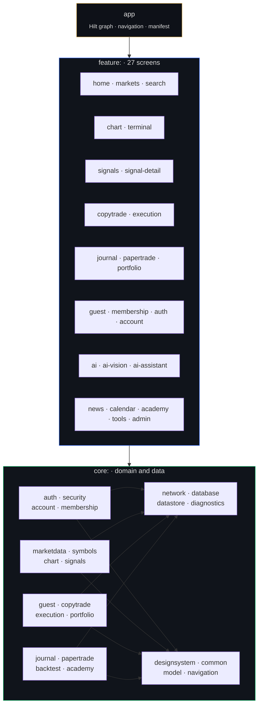
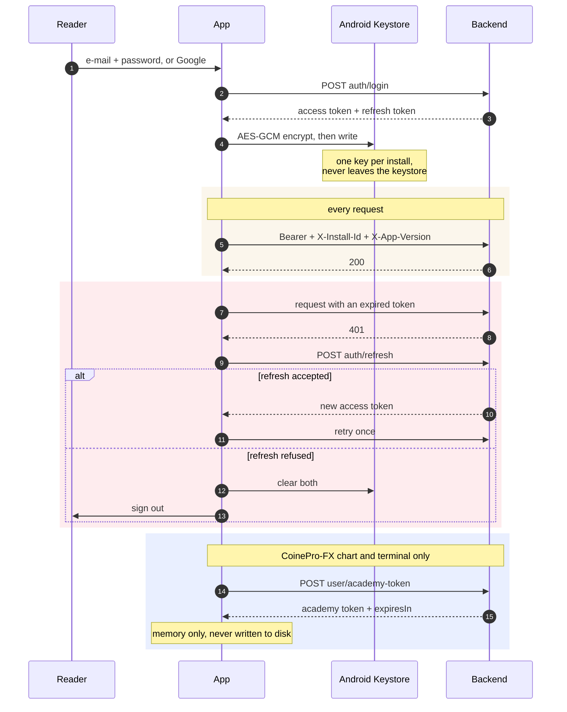
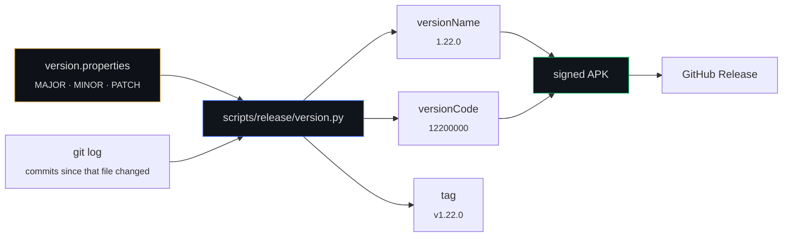

<div align="center">



<br>

**English** · [فارسی](README.fa.md)

<br>

[](CHANGELOG.md)
[](https://kotlinlang.org)
[](https://developer.android.com/jetpack/compose)
[](https://developer.android.com)
[](LICENSE)

</div>

---

## What this is

Pro-Chart is a native Android client for two independent trading backends — **CoinePro-FX** (gold,
silver and forex, with MT5 copy trading) and **TradeYar** (crypto, on LBank). One app, one account
per platform, one switch at the top of the home screen.

It is a **market terminal**, not a wallet and not an exchange. It never holds funds, never holds a
private key, and never takes custody of anything. Where a reader connects their own exchange or
broker account, orders are placed on that account with credentials the reader supplied.

The app opens **without registration**. Markets, charts, news and the published signal record are
all available to a guest; signals and copy trading require a free account.

<table>
<tr>
<td width="25%" align="center"><b>59</b><br><sub>Gradle modules</sub></td>
<td width="25%" align="center"><b>27</b><br><sub>feature screens</sub></td>
<td width="25%" align="center"><b>783</b><br><sub>unit tests</sub></td>
<td width="25%" align="center"><b>898</b><br><sub>vector symbol assets</sub></td>
</tr>
<tr>
<td align="center"><b>~61.5k</b><br><sub>lines of Kotlin</sub></td>
<td align="center"><b>2</b><br><sub>backends</sub></td>
<td align="center"><b>4</b><br><sub>CI quality gates</sub></td>
<td align="center"><b>fa-IR</b><br><sub>default locale, RTL</sub></td>
</tr>
</table>

---

## Table of contents

1. [Architecture](#architecture)
2. [The two backends](#the-two-backends)
3. [Sessions and tokens](#sessions-and-tokens)
4. [Guest mode](#guest-mode)
5. [The chart](#the-chart)
6. [The design system](#the-design-system)
7. [Numbers, dates and direction](#numbers-dates-and-direction)
8. [Security posture](#security-posture)
9. [Versioning](#versioning)
10. [Build and run](#build-and-run)
11. [Quality gates](#quality-gates)
12. [Repository layout](#repository-layout)
13. [Documentation index](#documentation-index)
14. [Licence](#licence)

---

## Architecture

Three layers, and the rule between them is one-directional: a `feature` may depend on `core`, a
`core` module may depend on other `core` modules, and nothing depends on `app`. `app` exists only to
wire things together — it holds the Hilt graph, the navigation host and the manifest, and almost no
logic.



**Why so many modules.** Two reasons, and neither is taste. The first is build time: a change to one
screen recompiles that screen, not the app. The second is that a module boundary is the only
dependency rule a compiler will actually enforce — `feature:journal` *cannot* reach into
`feature:chart` because Gradle will not let it, and no amount of hurry can talk it into it.

**The pattern inside a module.** Every domain follows the same three pieces:

| Piece | Responsibility | Testable without |
| --- | --- | --- |
| `…Api` | Retrofit interface and DTOs. Wire shapes only. | — |
| `…Gateway` | DTO → domain, and every failure mapped to `AppResult`. | a server |
| `…Controller` | `StateFlow` of UI state, and the decisions. | Android |

A `Controller` never sees a DTO and a `Gateway` never sees a `StateFlow`. That split is why 783
tests run on the JVM in seconds with no emulator.

---

## The two backends

They are genuinely different products that happen to share an app. The differences are not
cosmetic — the route prefixes, the payload envelopes, the error shapes and the feature sets all
differ, and pretending otherwise is how a crypto session ends up asking a forex server for a route
it has never had.

| | CoinePro-FX | TradeYar |
| --- | --- | --- |
| Market | Gold, silver, forex | Crypto, on LBank |
| Route prefix | `user/…` | `api/mobile/v1/…` |
| Execution | **Copy trading** — link MT5, the engine mirrors | Signals; the reader trades on their own exchange |
| Profile envelope | bare | wrapped in `user` |
| Error envelope | `{"detail":{"code","message"}}` | RFC 7807 |
| Membership | subscription plans | affiliate — exchange UID, verified against the exchange |
| Terminal | full web terminal, behind an academy token | — |

Both are addressed through the same `NetworkFactory`, with a separate `OkHttpClient`, session store
and install id per platform. The install id being **per platform** is deliberate: one install
presents two different identifiers, so neither backend can read the reader's presence on the other
from it.

Every path is pinned in a test. That is not ceremony — a hard-coded prefix once turned every crypto
session restore into a 404 that the app reported to readers as "session exists but could not be
revalidated", which is an outage message for a wiring mistake.

---

## Sessions and tokens

Three credentials exist, and each has a different lifetime, a different scope and a different place
to live.



**The access and refresh tokens** are encrypted with AES-GCM under a key generated in the Android
keystore, and the preference key is per platform so one backend's session cannot be read as the
other's.

**The academy token** is derived, short-lived and held in memory only. Writing it to disk would add
a second secret to protect in order to save one request per twelve hours. Its lifetime is taken from
the relative `expiresIn` rather than the absolute stamp, because a device whose clock is wrong
compares an absolute time against a wrong *now* and gets a wrong answer — an hour fast and every
freshly minted token looks expired.

**The guest token** creates no account, cannot be refreshed, and opens three chart routes. A refresh
token for somebody who has not signed up would be a durable identifier, which is the one thing guest
mode must not have.

---

## Guest mode

The app used to open on a sign-in form. That is a password field asked before any reason to answer
it, in front of somebody who followed a link and has no idea yet whether the thing is worth an
account.

It now opens on the market. Real prices, the published headlines, the community, and the **signal
track record** — every row a real published signal that has closed, with the P&L the ladder actually
banked. Nothing is blurred or truncated to make a point; something dressed up to look withheld is an
advertisement, and this is the product.

The membership card underneath states the four conditions in full and carries the **real referral
links, from the server**. That last part is the load-bearing one: a link compiled into the app is
wrong the day it changes, and a wrong one does not fail visibly — the exchange simply never records
the account as Pro-Chart's, so the reader funds it, submits a UID, and is refused for a reason
nothing on screen can explain.

---

## The chart

A Compose `Canvas` engine, ported from the owner's earlier web product rather than wrapped around a
library. Candles, Heikin-Ashi, line and area; pan, zoom and crosshair; indicators; drawing tools;
and the setup renderer that both AI signals and the terminal's own scripting feed.

Around it:

* **Bar replay** — indicators, levels and markers all derive from one `visibleSeries`, so replay
  cannot leak a future bar into a moving average.
* **Setup sheet** — R:R, distances and position size from risk, read off the newest complete
  long/short drawing.
* **Backtest** — three strategies, fills at the **open of bar n+1**, costs defaulting to 5bp rather
  than zero, drawdown peak-to-trough. A backtest that fills at the signal bar's close is a machine
  for producing encouraging nonsense.
* **Saved layouts** — type, timeframe and indicators. Deliberately *not* drawings: a trend line is
  anchored to one instrument's prices and dates, and applying a layout that carried drawings would
  paste last week's lines onto whatever chart it was applied to.
* **Sharing** — the chart itself, not the screen, through a FileProvider scoped to one cache
  directory and granted for a single intent.

> **`namascript` is not reimplemented natively.** It is a Pine-like scripting language evaluated
> with `new Function()` inside a Web Worker, and there is no Kotlin analogue short of writing a
> lexer, a parser, an interpreter and about seventy rolling-state builtins. It stays in the web
> terminal, reachable behind one button, and its `riskreward()` output renders through the same
> setup path the native chart already draws. See [the chart section](#the-chart) and
> `feature/terminal`.

---

## The design system

`core:designsystem` holds the palette, the spacing scale, the shapes, the motion curves and every
shared component. Three rules are enforced by CI rather than by review, because each is cheap to
break by accident and expensive to notice:

1. **No blur.** Elevation is a hairline plus at most one very soft shadow. On Android a blur is a
   render-effect pass per frame, so a blurred panel behind a scrolling list is a measurable cost as
   well as a look.
2. **No coloured glows.** A shadow is black at low alpha; colour goes in the fill or the border.
3. **Gradients only where allow-listed** — the brand lockup, a thinking indicator, an equity curve
   and the chart's own area fill. A gradient on a card or a button is what makes an app read as
   glassy rather than sharp.

Continuous motion is allowed in exactly one place — reporting that work is genuinely still running —
and only when the same file consults `continuousMotionAllowed()`, so a reader who turned animations
off never sees a loop.

**`LocalPageAccent`** carries one colour per domain: analysis blue on markets and charts, brand gold
on execution, social green on copy trading, destructive red on account deletion. One button
component, four identities.

---

## Numbers, dates and direction

Persian is the default locale and the app is right-to-left. Three rules follow from that, and all
three are enforced in code rather than remembered:

**Latin digits for market figures, Persian digits for prose counts.** A price, a quantity, a
percentage or a chart axis stays Latin, so a reader can compare it against MetaTrader or LBank
without converting in their head. A lesson number or a member count is Persian. `MarketNumberFormatter`
pins `Locale.US` for the first; `Int.toPersianDigits()` exists once, in `core:common`, for the
second — there were three copies before, and the way the rule actually broke was somebody hand-writing
`"${index + 1}."` without thinking of it as formatting a number.

**Dates are Solar Hijri.** The economic calendar printed `Wed, Aug 26` into a Persian interface for
a reader whose phone says ۵ شهریور. `JalaliDate` implements the Borkowski algorithm with its 33-year
break table — a simplified modulus disagrees with the printed calendar about once a decade, and the
day it disagrees is a day the app shows the wrong date for a release somebody is trading. The
portfolio's monthly breakdown buckets by Solar Hijri months too, because Mordad runs from 23 July to
22 August and a Gregorian bucket under a Persian name attributes three weeks to the wrong month.

**The clock stays Latin.** `14:30` is read against a broker's session table. It is a market figure in
everything but name.

**Latin runs are isolated.** `BidiText.isolateLtr` wraps every ticker and every number so it cannot
reorder inside a Persian sentence.

---

## Security posture

| Area | Position |
| --- | --- |
| Transport | HTTPS only. `usesCleartextTraffic=false`, a network security config that trusts system anchors and **not** user-installed ones. |
| Token storage | AES-GCM under an Android keystore key, per platform. |
| Backup | `allowBackup=false`. |
| Logging | Zero `Log.*` in production code. The debug-only OkHttp logger is `BASIC` and redacts `Authorization`, `Cookie` and `Set-Cookie`. |
| Deep links | Exact host and exact path. The password-reset link is an **App Link** verified against `assetlinks.json`, because a custom scheme any app may register is not somewhere to put a credential. |
| FileProvider | `exported=false`, scoped to one cache directory, granted per intent. |
| WebView | Origin compared by **parsed host**, not by string prefix. No JavaScript is injected at all; the academy token rides in the URL fragment, which browsers never send to a server. |
| Diagnostics | The admin panel is five taps behind the version number, masks every secret to its last four characters, masks hostnames, and records no request bodies or headers. |
| Secrets | Never in the repository. The whole git history — every object, not just the checkout — is scanned in CI. |

The complete review, including the bypasses that were found and fixed, is in `CHANGELOG.md` under
`1.20.1`.

---

## Versioning

One file is the source of truth — `version.properties` — and the Android `versionCode` is *derived*
from it rather than tracked separately. Two numbers meaning the same thing but edited in two places
disagree eventually.

```
versionCode = MAJOR×10,000,000 + MINOR×100,000 + PATCH×1,000 + BUILD
```

`BUILD` is the number of commits since `version.properties` last changed, so every push produces a
code strictly above the one before it without anyone remembering to bump anything. Bumping any field
jumps further than `BUILD` can reach, so the order can never invert.



`--check` reads the weight constants back out of `app/build.gradle.kts` and fails on drift, so the
arithmetic cannot exist in two languages and quietly disagree. Full scheme: [`docs/VERSIONING.md`](docs/VERSIONING.md).

---

## Build and run

**Requirements:** JDK 17, Android SDK with `compileSdk 36` and `build-tools 36.0.0`, Gradle 9.4.0
(the wrapper handles it).

```bash
git clone https://github.com/BehnamJalaliCo/CoinePro-App.git
cd CoinePro-App
cp local.properties.example local.properties   # then fill in the base URLs
./gradlew testDebugUnitTest
./gradlew :app:assembleDebug
```

A release build additionally needs the signing keystore and `google-services.json`, neither of which
is in this repository. Without `google-services.json` the build still succeeds — the Google Services
plugin is applied only when the file exists — but push notifications will not work and nothing at
runtime says so.

| Property | Meaning |
| --- | --- |
| `COINEPRO_{DEBUG,STAGING,PRODUCTION}_API_BASE_URL` | CoinePro-FX base URL |
| `COINEPRO_{…}_TRADEYAR_API_BASE_URL` | TradeYar base URL |
| `COINEPRO_{…}_TERMINAL_URL` | fallback only; the server reports the real one |
| `COINEPRO_RELEASE_{STORE_FILE,STORE_PASSWORD,KEY_ALIAS,KEY_PASSWORD}` | release signing |

Staging and production base URLs are asserted to differ at configuration time. A staging build
pointed at production is not a build anybody notices until it has written something.

---

## Quality gates

Four, all of them in CI and all of them runnable locally. They exist because each one is a mistake
that was actually made here at least once.

```bash
python3 scripts/quality/check-cross-phase-consistency.py   # module map, nav, cache scope, auth naming
bash   scripts/quality/check-motion-policy.sh              # reduced motion, blur, glows, gradients
bash   scripts/security/scan-secrets.sh                    # every tracked file
python3 scripts/quality/redact-backend-internals.py --check # no server module names or cache keys in docs
./gradlew testDebugUnitTest :app:assembleRelease
```

The release job additionally verifies the signature with `apksigner` and reads the **dex** to prove
R8 kept the fields Gson reflects on. That last check is not paranoia: a build once shipped where
every sign-in posted single-letter JSON keys, and `mapping.txt` did not reveal it, because a mapping
file lists what was *renamed* and absence there is not proof of anything.

---

## Repository layout

```
app/                     Hilt graph, navigation host, manifest, MainActivity
benchmark/               macrobenchmark and the baseline profile
core/
  common/                AppResult, formatters, Jalali dates, bidi helpers
  designsystem/          palette, spacing, shapes, motion, shared components
  network/               OkHttp + Retrofit factory, ApiErrors
  security/              keystore cipher and token storage
  auth/ account/         sessions, capabilities, profile, deletion
  membership/            UID submission and the seven membership states
  marketdata/ symbols/   quotes, classification, ranking, fuzzy search
  chart/                 the engine: indicators, transforms, replay, overlays
  signals/ copytrade/    signals and MT5 mirroring
  journal/ papertrade/   the reader's own writing, and simulated trades
  backtest/ portfolio/   strategy testing and performance
  guest/                 the public surface
  diagnostics/           request log, endpoint catalogue, prober
feature/                 27 screens, one module each
design/                  brand master, symbol archives, Play assets
docs/                    contracts, legal texts, phase records, research
scripts/
  design/                every brand raster and the README banner
  quality/ security/     the gates
  release/               version arithmetic and the smoke test
  site/                  the legal site renderer
site/                    the built legal pages, committed so a diff shows changes
```

---

## Documentation index

| Document | What it answers |
| --- | --- |
| [`CHANGELOG.md`](CHANGELOG.md) | Every version, what changed and why |
| [`docs/VERSIONING.md`](docs/VERSIONING.md) | The version scheme in full |
| [`docs/DESIGN_DIRECTION.md`](docs/DESIGN_DIRECTION.md) | The visual language and its rules |
| [`docs/PRODUCT_ROADMAP.md`](docs/PRODUCT_ROADMAP.md) | Phases, module map, what is next |
| [`docs/BACKEND_ROUTE_MAP.md`](docs/BACKEND_ROUTE_MAP.md) | Every route the app calls |
| [`docs/PLAY_LISTING.md`](docs/PLAY_LISTING.md) | The Play form, filled in |
| [`docs/PLAY_COUNTRIES.md`](docs/PLAY_COUNTRIES.md) | Which countries, and the licensing research behind it |
| [`docs/legal/`](docs/legal/) | Privacy policy and terms, published at the URLs the app links to |
| [`docs/assetlinks/`](docs/assetlinks/) | App Link verification files, one per host |

---

## Licence

**Proprietary. All rights reserved.** Being able to read this repository is not permission to use
it. See [`LICENSE`](LICENSE), which also records the third-party licences this repository vendors
and continues to honour.

<div align="center">
<sub>© 2026 Behnam Jalali · <a href="mailto:behnamjalali88@gmail.com">behnamjalali88@gmail.com</a></sub>
</div>
